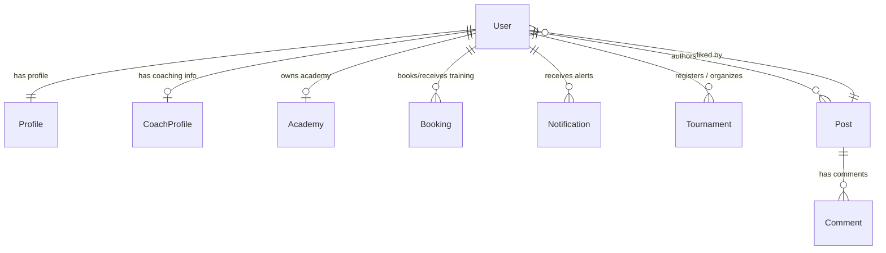

# ATHLIX - MongoDB Schema Design

This document details the production-grade MongoDB schema design and relationships built for **ATHLIX**.

---

## 🗺️ Entity Relationship Diagram (ERD)

---

## 🗄️ Collections & Model Definitions

### 1. User
Credentials and role security records.
- **Fields**:
  - `name` (String, required, trimmed)
  - `email` (String, required, unique, lowercase, indexed)
  - `password` (String, required, minlength 6, pre-save encrypted)
  - `role` (String, enum: `['athlete', 'coach', 'academy_owner', 'tournament_organizer', 'admin']`, indexed)
  - `isActive` (Boolean, default `true`)

### 2. Profile
Extended personal profile for Athletes and generic users.
- **Fields**:
  - `userId` (ObjectId ref User, required, unique, indexed)
  - `bio` (String)
  - `discipline` (String, enum: `['Karate', 'BJJ', 'Judo', 'Muay Thai', 'Taekwondo', 'Boxing', 'MMA', 'Wrestling', 'Other']`)
  - `beltRank` (String, default `White`)
  - `achievements` (Array of Strings)
  - `location` (String, indexed for searches)
  - `socialLinks` (Object: `instagram`, `twitter`, `linkedin`)
  - `profileImage` (String URL)

### 3. CoachProfile
Professional coaching details.
- **Fields**:
  - `userId` (ObjectId ref User, required, unique, indexed)
  - `certifications` (Array of Strings)
  - `experienceYears` (Number, min 0)
  - `pricingPerHour` (Number, min 0)
  - `availability` (Array of Availability Subschemas: `dayOfWeek`, `startTime`, `endTime`)
  - `ratings` (Number, min 0, max 5, default 0)
  - `active` (Boolean, default `true`)

### 4. Academy
Academy/Gym listings.
- **Fields**:
  - `name` (String, required, indexed)
  - `address` (String, required)
  - `location` (GeoJSON Point: `type`, `coordinates [longitude, latitude]`, geospatial indexed `2dsphere`)
  - `ownerId` (ObjectId ref User, required, indexed)
  - `disciplines` (Array of String enums)
  - `description` (String)
  - `schedule` (String)
  - `gallery` (Array of Strings)
  - `membersCount` (Number, default 0)

### 5. Tournament
Combat tournament events.
- **Fields**:
  - `title` (String, required, indexed)
  - `description` (String, required)
  - `date` (Date, required, indexed)
  - `registrationDeadline` (Date, required)
  - `location` (String, required)
  - `entryFee` (Number, required, min 0)
  - `disciplines` (Array of String enums)
  - `organizerId` (ObjectId ref User, required, indexed)
  - `registrations` (Array of ObjectIds ref User)
  - `brackets` (String URL / JSON schema)
  - `status` (String, enum: `['upcoming', 'ongoing', 'completed']`, indexed)

### 6. Post
Community feed content.
- **Fields**:
  - `authorId` (ObjectId ref User, required, indexed)
  - `content` (String, required)
  - `mediaUrl` (String)
  - `mediaType` (String, enum: `['image', 'video', 'none']`, default `none`)
  - `likes` (Array of ObjectIds ref User)
  - `commentsCount` (Number, default 0)

### 7. Comment
Post replies.
- **Fields**:
  - `authorId` (ObjectId ref User, required, indexed)
  - `postId` (ObjectId ref Post, required, indexed)
  - `content` (String, required)

### 8. Booking
Training session scheduler.
- **Fields**:
  - `athleteId` (ObjectId ref User, required, indexed)
  - `coachId` (ObjectId ref User, required, indexed)
  - `scheduledTime` (Date, required, indexed)
  - `durationMinutes` (Number, required, min 15)
  - `price` (Number, required, min 0)
  - `status` (String, enum: `['pending', 'accepted', 'rejected', 'completed']`, indexed)

### 9. Notification
In-app alerts.
- **Fields**:
  - `recipientId` (ObjectId ref User, required, indexed)
  - `senderId` (ObjectId ref User, required)
  - `type` (String, enum: `['booking', 'social', 'tournament', 'system']`)
  - `message` (String, required)
  - `read` (Boolean, default `false`, indexed)
  - `link` (String)
